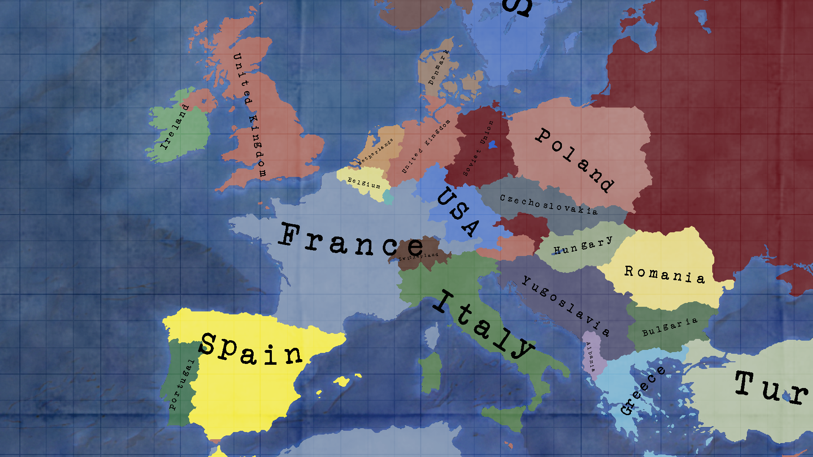

# ProjetGuerreFroide

**ColdWarProject** is a grand strategy game set during the Cold War. It is an open-source version of the unreleased
game "East vs West" by Paradox Interactive, aiming to provide a more realistic simulation of the economy,
a refactored political and law system, and simplified warfare mechanics.

