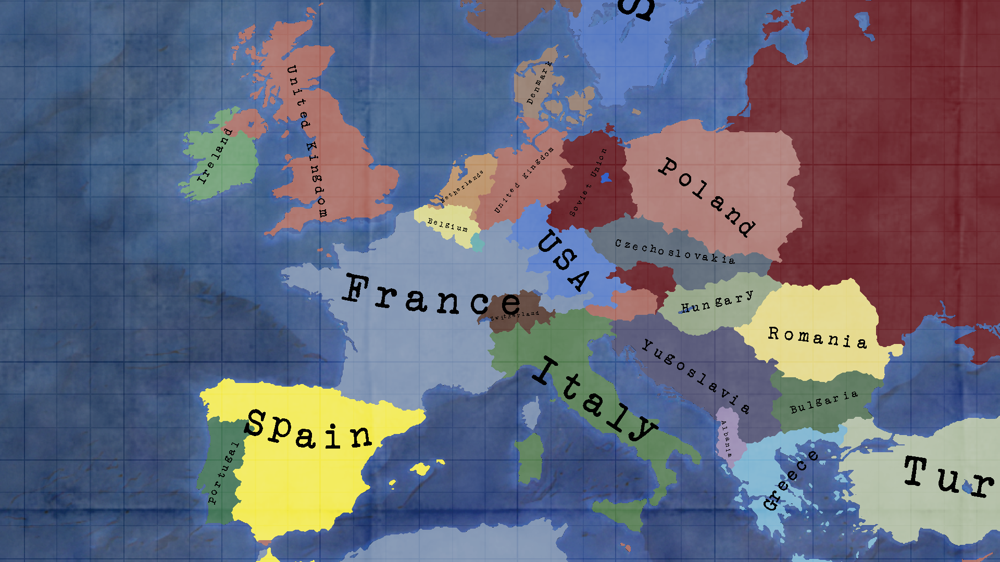

# ProjetGuerreFroide

## About
**ProjetGuerreFroide** is a grand strategy game set during the Cold War. It is an open-source version of the unreleased
game "East vs West" by Paradox Interactive, aiming to provide a more realistic simulation of the economy,
a refactored political and law system, and simplified warfare mechanics.

## Stack
- libGDX
- WebGPU-native
- flecs-ecs

## License
See `LICENSE` — https://github.com/elebras1/Projet-Guerre-Froide/blob/main/LICENSE
